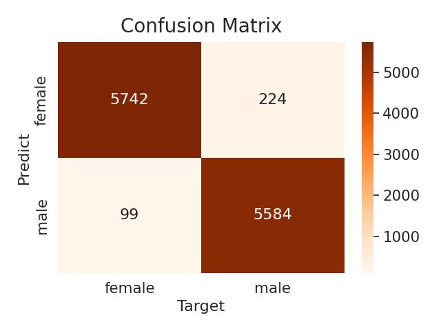
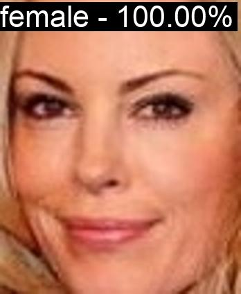

# Gender Classification

This project simply classifies whether face is **Male** or **Female**

## Environments

- Python 3.10.9
- torch 1.13.1
- torchvision 0.14.1

Install requirements

``` bash
pip install -r requirements.txt
```

## Data

- I get my data from [here](https://www.kaggle.com/datasets/cashutosh/gender-classification-dataset) and use some of my own data

- Data in this format

``` files
|-- data
    |-- train
    |   |-- class 1
    |   |-- class 2
    |   `-- ...
    `-- valid
        |-- class 1
        |-- class 2
        `-- ...
```

## Config

Modify config in `./cfg/config.yaml` or create your own `.yaml` config file with the same format.

## Train

Simply run 

``` bash
python train.py --cfg ./cfg/config.yaml
```

## Experiment Results

Some experiment results

| Model | Accuracy | Confusion Matrix | Pretrained | Model size |
| --- | :---: | :---: | :---: | :---: |
| **Regnet_Y_32MF** | 97.33% |  | [Model](https://drive.google.com/file/d/1t7O0AZeKVIdLMMYIyGNnZm4D6py1YXjD/view?usp=share_link) | 554.10MB |

You can download weight file above and put in `weights` folder and run inference

``` bash
python infer.py
```

## Some inference results

| Male | Female | 
| :---: | :---: |
|  |  |

You can try on your own :wink:
